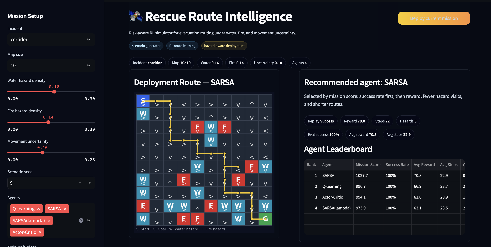

# Rescue Route Intelligence

Risk-aware reinforcement learning simulator for evacuation routing under water, fire, and movement uncertainty.

This project trains reinforcement learning agents to navigate hazardous rescue scenarios. Users can generate disaster maps, deploy multiple RL agents, compare their performance, and inspect the recommended evacuation route through an interactive Streamlit UI.



## What It Does

Rescue Route Intelligence simulates a simplified emergency navigation problem.

An agent starts from a rescue base and must reach a shelter while avoiding hazardous terrain. Water cells represent difficult terrain, fire cells represent high-risk areas, and stochastic movement represents uncertainty during execution.

The system compares different reinforcement learning agents and recommends the best route policy based on:

* success rate
* accumulated reward
* route length
* water/fire exposure

The goal is not just to visualize RL training, but to turn a gridworld task into a small decision-support simulator for risk-aware route planning.

指揮官，把這段加在 demo 圖下面、`## Quick Start` 前面即可：

## Live Demo

The app is deployed on Streamlit Cloud and can be accessed here:

[Open Rescue Route Intelligence](https://rescue-route-ai.streamlit.app/)

Use the sidebar to configure a disaster scenario, then click `Deploy current mission` to train and evaluate the selected agents. The app will generate a recommended evacuation policy, display the learned route, and rank agents by mission performance.

## Quick Start

Install dependencies:

```
pip install -r requirements.txt
```

Launch the app:

```
streamlit run app.py
```

Then open the local Streamlit URL shown in the terminal.

## Using the App

Open the sidebar to configure a mission:

* incident type: mixed, flood, wildfire, corridor
* map size
* water hazard density
* fire hazard density
* movement uncertainty
* training budget
* evaluation rollouts
* agents to compare

Then click:

```
Deploy current mission
```

or:

```
Apply and deploy
```

The app will train the selected agents, evaluate them, rank their policies, and display the recommended deployment route.

## Implemented Agents

* Q-learning
* SARSA
* SARSA(λ)
* Actor-Critic

All agents are implemented manually in Python. No high-level RL frameworks such as Stable-Baselines or RLlib are used.

## Coursework Experiment Commands

Run the original benchmark experiments:

```
python experiments/run_all.py
```

Save report plots and summary outputs:

```
python experiments/run_all.py --save
```

Run hyperparameter tuning:

```
python experiments/tune.py
```

These commands reproduce the coursework-oriented experiment pipeline. The Streamlit app is the extended portfolio version built on top of the same RL core.

## Notes

The fixed 4x4 gridworld is used for the coursework benchmark. The interactive app extends the idea into larger configurable rescue scenarios for demonstration and portfolio use.
